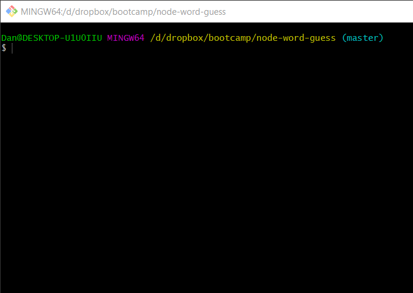
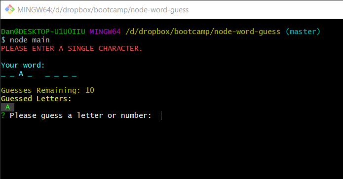
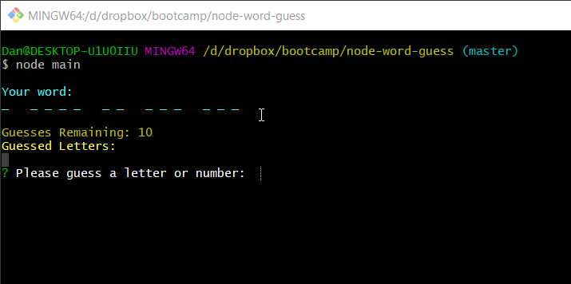
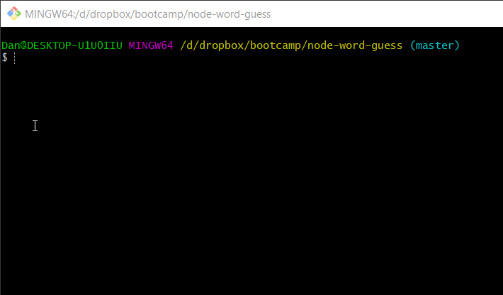

# NodeJS Hangman
_A science fiction movie hangman game_

## Before you play:
1. Clone the directory and ensure you have installed [the latest LTS of nodeJS](https://nodejs.org/)
2. From the installed directory, run: `npm install` to get the required dependencies, or manually install:
    - [Inquirer](https://www.npmjs.com/package/inquirer) using `npm install inquirer`
    - [Chalk-pipe](https://www.npmjs.com/package/chalk-pipe) using `npm install chalk-pipe`
3. From the main directory of the command line, type `node main` or `node main.js` to start the game!

## Rules
- You have 10 guesses to guess the movie title
- The title will be a combination of letters and numbers
    - Any spaces or punctiation will be revealed for you
- Incorrect answers decrement your guesses
- The game ends when you have successfully guessed the word, or your guess run out

## Sample Gameplay

|Clip Description|Clip|
|:-------:|:-------:|
|Start and input validation||
|Correctly guess the word||
|Run out of guesses||
|Exit from game||

# Good Luck!

